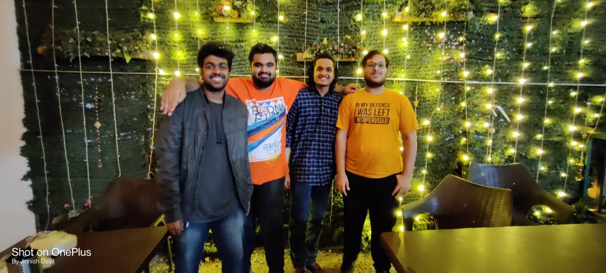

# PortraitMaker
This is the many would be interested in.

It takes 4 of your selected photos and the main image you want to process and it will return the processed image.
The processed image will be the main image made up of small small images you selected.Yes, you read it right!!!

Let's take an example:

if the main image is: 
 

<table>
  <tr>
    <td>image1</td>
    <td>image2</td>
    <td>image3</td>
    <td>image4</td>
  </tr>
  <tr>
    <td valign="top"></td>
    <td valign="top"></td>
    <td valign="top"></td>
    <td valign="top"></td>
  </tr>
 </table>
 
 
 Then the final Image returned by the app is: 
 
  
 
 
 You don't find the Image fascinating??
 just zoom in the image and you will be suprised!!
 

